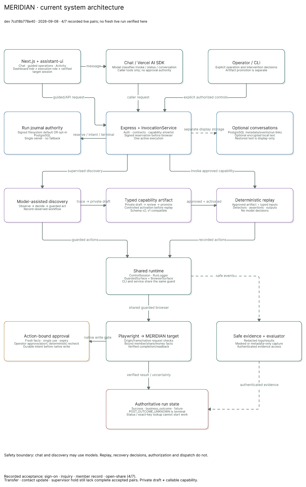

# Computer-Use Automation System

An LLM discovers how to complete a goal against a live legacy-style UI, records
what it learned as a **typed, versioned capability artifact**, and from then on
the capability replays **deterministically — no model in the loop** — with an
explicit error taxonomy, safety guardrails, and a human-escalation path that
takes over the live session.

> The model discovers. The artifact becomes a reusable capability.
> Deterministic replay is how an AI agent invokes it in production.

What it is for, in concrete terms: **[docs/use-cases.md](docs/use-cases.md)**.
Design rationale, trade-offs, and cut lines: **[REPORT.md](REPORT.md)**.
Evidence from real runs: **[evidence/](evidence/)**.



## Setup

Requirements: Node 22+, an OpenAI API key (discovery only — replay never needs one).

```bash
npm install
npx playwright install chromium

# Local CI: run `npm run ci` (typecheck + full suite, ~22s) by hand, or wire it
# to run automatically before every push:
git config core.hooksPath .githooks

# Discovery credentials — either plain OpenAI:
export OPENAI_API_KEY=sk-...
# optional: export OPENAI_MODEL=gpt-5.6-luna   (default)

# ...or Azure OpenAI (takes precedence when set):
export AZURE_OPENAI_ENDPOINT=https://<resource>.openai.azure.com
export AZURE_OPENAI_API_KEY=...
export AZURE_OPENAI_DEPLOYMENT=<deployment name, used as the model>
# optional: export AZURE_OPENAI_API_VERSION=2024-10-21
```

Everything runs locally. The target application is a deliberately hostile mock
"legacy credit-union servicing" app (framesets, nested tables, no test IDs)
that ships in this repo — no external services, no real credentials, no real PII.

## Demo path

**1. Start the target app** (keep it running in its own terminal):

```bash
npm run target-app
```

**2. Discovery — the LLM works out the flow and records a capability:**

```bash
npm run discover -- --goal "Look up member 12345 and read their current savings balance" \
  --name lookup-member-balance --param memberId=12345
```

This produces `artifacts/lookup-member-balance.v1.0.0.json` (status: `draft`)
and a full evidence trail under `evidence/runs/<runId>/`.

**3. Review + approve the artifact** (drafts refuse to replay unattended):

```bash
npm run replay -- --artifact artifacts/lookup-member-balance.v1.0.0.json --approve
```

**4. Deterministic replay — different member, no LLM:**

```bash
npm run replay -- --artifact artifacts/lookup-member-balance.v1.0.0.json --params '{"memberId":"23456"}'
```

Returns `{"status":"success","outputs":{"savings_balance":"9,812.55"}}`.

**5. Error & exceptional-state replays:**

```bash
# Legitimate business outcome — not a crash:
npm run replay -- --artifact artifacts/lookup-member-balance.v1.0.0.json --params '{"memberId":"99999"}'
#   -> {"status":"business_outcome","outcomeCode":"NO_SUCH_MEMBER", ...}

# Recoverable interstitial — dismissed automatically, run still succeeds:
npm run replay -- --artifact artifacts/lookup-member-balance.v1.0.0.json --params '{"memberId":"12345"}' \
  --entry-override "http://localhost:4173/?sim=maintenance"

# Hard failure — session expiry detected and reported with evidence:
npm run replay -- --artifact artifacts/lookup-member-balance.v1.0.0.json --params '{"memberId":"12345"}' \
  --entry-override "http://localhost:4173/?sim=timeout"

# Hard failure — permission denied (operator security profile), fatal detector:
npm run replay -- --artifact artifacts/lookup-member-balance.v1.0.0.json --params '{"memberId":"12345"}' \
  --entry-override "http://localhost:4173/?sim=denied"

# Hard failure — an unexpected native confirm() dialog is dismissed (never accepted)
# and named in the failure that follows:
npm run replay -- --artifact artifacts/lookup-member-balance.v1.0.0.json --params '{"memberId":"12345"}' \
  --entry-override "http://localhost:4173/?sim=confirm"
#   -> {"status":"failure","failure":{"stepId":"s2","observed":"unexpected confirm dialog \"...\" was dismissed at s1; then ..."}}
```

**6. The mutating flow — second capability** (form fill → confirmation review, commit never clicked):

```bash
npm run discover -- --goal "For member 12345, start opening a new sub-account of type Secondary Savings with nickname VACATION FUND and initial deposit 25.00. Stop at the confirmation review screen — do NOT click Open Account — and read the confirmed nickname and deposit from the review table." \
  --name open-subaccount-to-confirmation --param memberId=12345 --param nickname="VACATION FUND" --param deposit=25.00
npm run replay -- --artifact artifacts/open-subaccount-to-confirmation.v1.0.0.json --approve
# Different member and values:
npm run replay -- --artifact artifacts/open-subaccount-to-confirmation.v1.0.0.json \
  --params '{"memberId":"23456","nickname":"RAINY DAY","deposit":"50.00"}'
# Below-minimum deposit -> business_outcome VALIDATION_REJECTED:
npm run replay -- --artifact artifacts/open-subaccount-to-confirmation.v1.0.0.json \
  --params '{"memberId":"12345","nickname":"TEST","deposit":"1.00"}'
```

**7. Human escalation & handoff** (scripted end-to-end demo):

```bash
# Terminal A — start the app with simulated vendor drift (renamed button):
BREAK_MARKUP=1 npm run target-app

# Terminal B — replay hits the drift, escalates, a scripted "operator"
# attaches to the SAME live session over CDP, performs the step, hands back:
npx tsx scripts/demo-escalation.ts
```

For a live manual handoff instead, run any replay with `--attended`: the
browser runs headful, and when the run gets stuck you operate the window
yourself, then answer `retry` / `skip` / `abort` at the operator prompt.

**8. Cross-tenant replay — one capability, many tenants** (the second
"tenant" runs the same mock app with `?tenant=premier`: rebranded banner,
menu entry renamed to "Account Inquiry"):

```bash
# Without the overlay the base artifact fails loudly at the renamed control:
npm run replay -- --artifact artifacts/lookup-member-balance.v1.0.0.json \
  --entry-override "http://localhost:4173/?tenant=premier" --params '{"memberId":"23456"}'
#   -> {"status":"failure","failure":{"stepId":"s1","observed":"Could not uniquely resolve target ...: role=0, text=0, css=2"}}

# With a thin tenant overlay, the same base replays — no re-recording:
npm run replay -- --artifact artifacts/lookup-member-balance.v1.0.0.json \
  --overlay config/overlays/premier.json --params '{"memberId":"23456"}'
#   -> {"status":"success","outputs":{"savings_balance":"9,812.55"}}
```

**9. Capability catalog** (what an agent could discover and invoke):

```bash
npm run list
```

**10. Re-check saved artifacts against the current risk rules** (runs in the
test suite, so a tightened risk floor cannot leave an approved artifact behind):

```bash
npm run validate
#   -> All artifacts satisfy the current risk floor.   (exit 1 on drift)
```

## Running without live services

Replay needs no API key. The test suite (including a full discovery→record→replay
integration test with a scripted stand-in LLM) runs completely offline:

```bash
npm test        # the suite alone
npm run ci      # what the pre-push hook runs: typecheck + the suite, ~22s
```

## Repo map

```
target-app/       the hostile mock bank app (+ ?sim=... error injection)
src/surface/      Surface abstraction (perceive/act seam) + Playwright impl + policy guard
src/agent/        LLM discovery loop (OpenAI tool-calling)
src/artifact/     capability schema (Zod) + recorder (trace -> parameterized artifact)
src/replay/       deterministic executor, tiered locators, detectors, outcome taxonomy
src/escalation/   control-owner state machine + operator console
src/safety/       policy allowlist + redaction
src/evidence/     structured run logging
config/           policy.json + per-app detector profiles + tenant overlays
artifacts/        recorded capabilities (JSON, reviewable, versioned)
evidence/         committed demo runs (discovery, replays, escalation)
test/             vitest suite + hand-written fixtures
scripts/          scripted end-to-end escalation demo
docs/             use cases, architecture diagram, demo runbook, audits, plans
.githooks/        pre-push local CI gate (see Setup)
```
