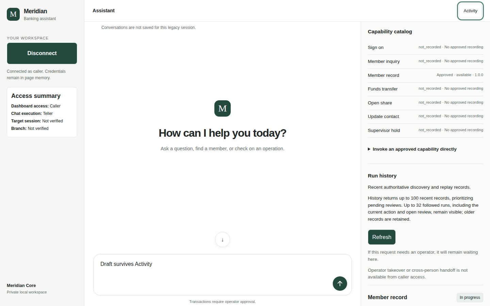
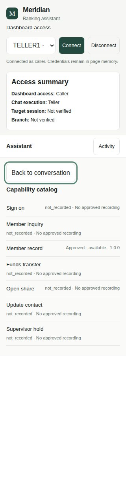
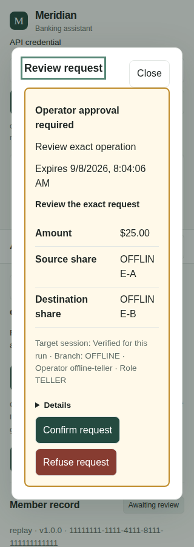
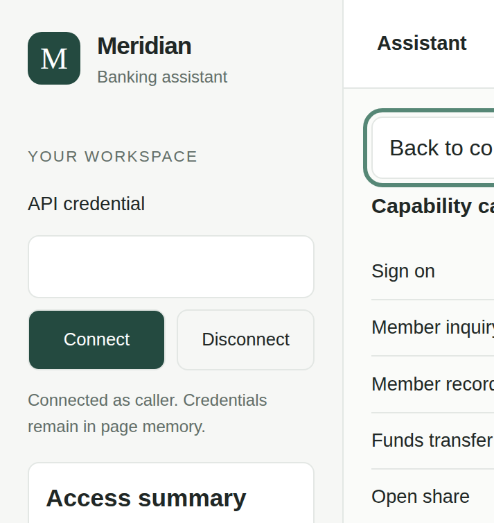

# MERIDIAN UI Walkthrough

## Provenance

The application, test, and four-image evidence source for this walkthrough is
`a3a1827fac444d05036dd1ee9a2200a7a908d802`. It is checked out on
`codex/meridian-ui-accessibility`. This is the source/evidence SHA, not the
documentation commit: the final documentation commit and PR head necessarily
include a later SHA because this file is committed afterward.

The checks were run in the shared Ubuntu environment (`Linux onubuntu`, kernel
`6.8.0-124-generic`, x86_64). The native-zoom check starts `/usr/bin/Xvfb` for
headed Chromium; its single-frame capture is 1440×900. The recorded runtime
and package output was:

```text
git rev-parse HEAD
a3a1827fac444d05036dd1ee9a2200a7a908d802
node --version
v22.22.0
npm --version
10.9.4
npm pkg get dependencies.next dependencies.react dependencies.@assistant-ui/react devDependencies.playwright devDependencies.vitest
{
  "dependencies.next": "16.3.4",
  "dependencies.react": "19.2.8",
  "dependencies.@assistant-ui/react": "0.15.18",
  "devDependencies.vitest": "^4.1.11"
}
```

`package-lock.json` (lockfile version 3) resolves Playwright to 1.62.1 and
Vitest to 4.1.11; Playwright is declared under `dependencies` as `^1.49.0`,
which is why `devDependencies.playwright` is absent from the `npm pkg get`
output above.

`npm run build` passed with Next.js 16.3.4 and Turbopack:

```text
> cu-capability-system@0.1.0 build
> next build

▲ Next.js 16.3.4 (Turbopack)
✓ Running next.config.mjs took 25ms

  Creating an optimized production build ...
✓ Compiled successfully in 13.5s
  Running TypeScript ...
  Finished TypeScript in 15.6s ...
  Collecting page data using 4 workers ...
  Generating static pages using 4 workers (0/3) ...
✓ Generating static pages using 4 workers (3/3) in 1414ms
  Finalizing page optimization ...
Route (app)
┌ ○ /
└ ○ /_not-found


○  (Static)  prerendered as static content
```

## Fixture boundaries and safety

All browser, model, run, dialog, and screenshot data referenced here are
offline synthetic fixtures. The focused suite routes the UI to a local test
server and explicitly invokes no MERIDIAN target. Fixture tokens, IDs,
members, branch names, balances, and approval facts are not live credentials,
records, or authorization.

The catalog intentionally shows one fixture capability as `Approved · available
· 1.0.0` and six as `not_recorded · No approved recording`. A fixture approval
may be inspected or exercised only to verify UI behavior; it is not permission
to post a real transaction. Caller access has no approval/takeover controls,
and the access summary keeps `Target session: Not verified` and
`Branch: Not verified` unless the current run supplies verified context. Do not treat any
image below as genuine authenticated demo acceptance.

## Keyboard walkthrough

1. Connect from the login form. With local access, leave `Role` at the
   `TELLER1 · Teller` option for caller coverage. `Tab` from the role selector
   reaches `Connect`; `Enter` submits it. Once connected, the login form is
   hidden and the sidebar shows the large `Disconnect`-only control. To use
   local supervisor sign-on, activate `Disconnect`, select `SUPER1 ·
   Supervisor`, enter `Operator` and `Password`, and submit `Connect`; the
   workspace opens only after the verified operator, role, and branch are
   returned. Failed passwords are cleared and locally throttled. In credential
   mode, enter the API credential and submit `Connect`; credentials remain only
   in page memory and the connected state also shows the large `Disconnect`
   control.

2. After connection, focus `Activity` and press `Enter`. At narrow widths,
   focus moves to `Back to conversation`; press `Enter` to close and return
   focus to `Activity`. At wide widths the chat and Activity panel remain
   side-by-side, so `Back to conversation` is hidden; pressing `Enter` on
   `Activity` still toggles the panel.

3. For an operator run awaiting review, activate its `Review request` button.
   The neutral `Review request` heading receives focus first. `Tab` visits
   `Close`, `Details`, `Confirm request`, and `Refuse request`, wrapping inside
   the modal; `Escape` closes it and returns focus to the opener. Inspect the
   exact visible request before confirming or refusing. An expired intervention
   must expose the text `Intervention expired.` and disable confirmation.

4. Use `Refresh` with `Enter` to request current authenticated history. In a
   run's details, `Tab` from the result table reaches `Run details and evidence`,
   then the `View result.json`, `View log.jsonl`, and `View masked.png` controls.
   Every focused control must retain a visible focus indicator; no action is
   inferred from color alone.

## Responsive Activity walkthrough

Connect to the caller fixture, type `Draft survives Activity`, and seed or
observe an active run. Scroll the `.messages` region to 320px, then focus
`Activity` and press `Enter`. The Activity view must open without a navigation
mutation. At 320px and 768px, verify that `Back to conversation` is visible
and focused; press `Enter` and verify that Activity regains focus, the draft
and active-run status remain, and the `.messages` scroll position returns to
320px. At 1024px and 1440px, verify the split view, hidden Back control, and
the same draft/run preservation while toggling Activity by keyboard.

The test also asserts `document.documentElement.scrollWidth <= innerWidth` at
each width and records no new `POST` to `/api/chat`, `/invoke`, `/decision`,
`/cancel`, or `/transaction` during Activity navigation.

The connected screenshots below show the current authenticated layout: the
login form is hidden and the sidebar contains only the large `Disconnect`
control for session exit.



*Activity open at 1440×900 — offline synthetic fixture.*



*Activity open at 320×1359 full-page capture — offline synthetic fixture.*

## Dialog walkthrough

The narrow dialog fixture represents an operator review request with amount
`$25.00`, source `OFFLINE-A`, destination `OFFLINE-B`, and a synthetic
`OFFLINE` branch. Those values demonstrate readable wrapping and the neutral
focus entry point; they are not a live transfer. Caller access can open the
same request for read-only inspection but never receives `Confirm request`,
`Refuse request`, `Retry after repair`, or `Stop request` controls. Operator
access receives only the action permitted by the current, unexpired public
intervention and verified action context.



*Review request at 320×902 — offline synthetic fixture.*

## Status and evidence walkthrough

Read the text status on each run card and in the dialog. The UI's plain-language
states include `Submitting`, `In progress`, `Recovering`, `Awaiting review`,
`Completed`, `Run stopped`, `Interrupted`, `Unable to verify outcome`, and
business outcomes such as `Insufficient funds`, `Validation rejected`, and
`Member not found`. `Unable to verify outcome` means the posting result is
unknown: investigate with a separate read-only inquiry and do not retry.

`Run history` is the caller's authoritative discovery/replay list. Operator
Activity starts on `Needs review (N)` and also exposes `All runs (N)`; arrow
keys move between these tabs and preserve a visible focus indicator. Use
`Run details and evidence` to inspect recorded inputs, safe run details, the
timeline, and authenticated evidence files. The synthetic status/evidence
check confirms that result JSON, event log, and masked image controls remain
keyboard reachable, that evidence is fetched with the caller's authorization,
and that an unauthenticated evidence request is rejected.

On a refresh outage, read
`Disconnected from run updates. Displayed data may be stale.`, refresh before acting, and preserve the last confirmed state. A
disconnect clears the authenticated workspace and chat. The focused fixture
also verifies that `localStorage` and `sessionStorage` stay empty.

## Width matrix

| CSS viewport width | Activity behavior | Exact checks |
| ---: | --- | --- |
| 320 | Narrow Activity view; `Back to conversation` is visible and focused. | Enter closes it; focus returns to Activity; draft, active status, and scrollTop 320 persist; no horizontal overflow or mutation POST. |
| 768 | Narrow Activity view with the same Back/focus handoff. | Enter closes it; focus, draft, active status, and scrollTop 320 persist; no horizontal overflow or mutation POST. |
| 1024 | Wide split view; chat and Activity remain visible; Back is hidden. | Activity toggles by Enter; draft and active status persist; no horizontal overflow or mutation POST. |
| 1440 | Wide split view; chat and Activity remain visible; Back is hidden. | Activity toggles by Enter; draft and active status persist; no horizontal overflow or mutation POST. |

The matrix is a responsive CSS-viewport check. It is separate from the
physical native-zoom capture below.

## Actual 200% browser zoom

Headed Chromium loaded a persistent-profile preference equivalent to 200%
browser zoom and captured one OS-level Xvfb frame at 1440×900. Chromium
reported `devicePixelRatio = 2`, `visualViewport.scale = 1`, `innerWidth =
720`, and `outerWidth × outerHeight = 1440 × 900`. The layout remained within
the measured CSS viewport, the catalog heading did not overflow, `Back to
conversation` received focus in the narrow CSS viewport, the draft survived
Activity navigation, and no mutation POST was emitted.

This was genuine browser zoom in headed Chromium. No CSS `zoom`,
`deviceScaleFactor`, `--force-device-scale-factor`, or CDP viewport emulation
was used. The image is the physical single-frame capture, not a CSS-scaled
mockup.



*Headed Chromium native 200% zoom, 1440×900 Xvfb frame — offline synthetic fixture.*

## Checks performed

The focused browser checks passed from the source/evidence SHA. The merged
`test/chat-ui.test.ts` file contains 100 tests; the offline file run passed 98
with the native-zoom opt-in and live PostgreSQL case skipped:

```text
MERIDIAN_WALKTHROUGH_SCREENSHOT_DIR=docs/meridian/evidence/ui-walkthrough npx vitest run test/chat-ui.test.ts -t 'preserves the conversation across responsive Activity navigation|offline operator review controls require live authority'
Test Files  1 passed (1)
Tests       2 passed | 98 skipped (100)

npx vitest run test/chat-ui.test.ts -t 'actual Chromium browser zoom at 200%|registers idempotent teardown|preserves the conversation across responsive Activity navigation|offline operator review controls require live authority|neutral replacement focus resets|Connect signs on directly|Connect does not open chat after sign-on|connects a local supervisor using operator and password|reconciles a clean tool-bearing chat stream|offline direct invocation keeps an uncertain request key|status text shows the authoritative step|operator Activity filters start in a review-first queue'
Test Files  1 passed (1)
Tests       14 passed | 86 skipped (100)

xvfb-run -a env MERIDIAN_NATIVE_ZOOM=1 MERIDIAN_WALKTHROUGH_SCREENSHOT_DIR=docs/meridian/evidence/ui-walkthrough npx vitest run test/chat-ui.test.ts -t 'actual Chromium browser zoom at 200%'
Test Files  1 passed (1)
Tests       1 passed | 99 skipped (100)

npx vitest run test/chat-ui.test.ts --testNamePattern='^(?!recovers a real PostgreSQL)'
Test Files  1 passed (1)
Tests       98 passed | 2 skipped (100)
Duration    191.53s (transform 1.38s, setup 0ms, import 2.67s, tests 188.55s, environment 0ms)
```

The required evidence/link/hygiene checks also passed: all four evidence
files exist, the required provenance/boundary phrases match this document,
and `git diff --check` is clean. The four checks were:

```bash
test -f docs/meridian/evidence/ui-walkthrough/activity-1440.png
test -f docs/meridian/evidence/ui-walkthrough/activity-320.png
test -f docs/meridian/evidence/ui-walkthrough/review-320.png
test -f docs/meridian/evidence/ui-walkthrough/native-zoom-200.png
rg -n 'offline synthetic fixture|200%|320|768|1024|1440|separate acceptance|source SHA|npm run build' docs/meridian/ui-walkthrough.md
git diff --check
```

## Separate genuine demo acceptance

Authenticated genuine-demo rehearsal remains a separate acceptance step and
was not performed. The source/evidence SHA, focused checks, build, and four
offline synthetic fixtures establish only the local UI behavior and its
documented safety boundaries; they do not establish a genuine authenticated
MERIDIAN operation, posting, approval, or target-session result.
